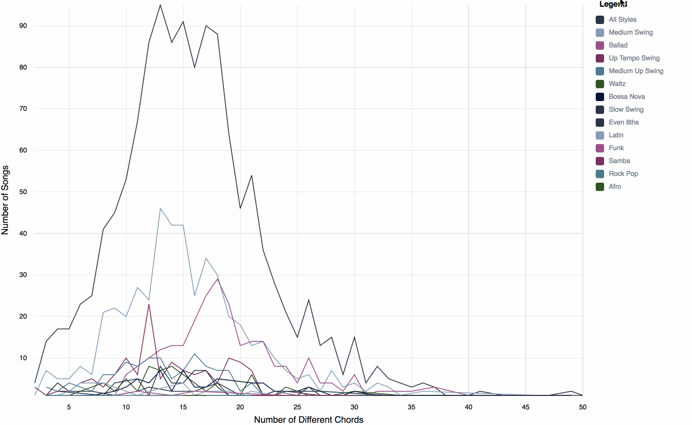
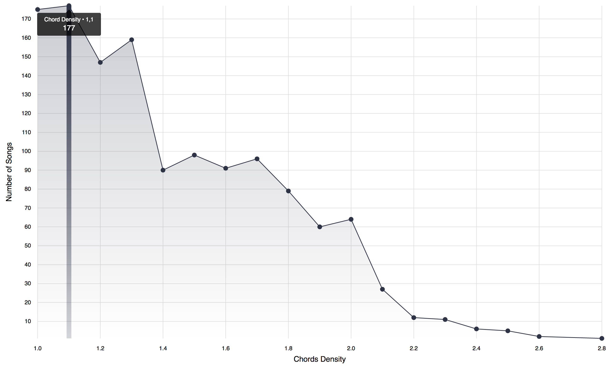

# Patterns in Jazz Harmony
This App analyzes the Leadsheets of 1300 Jazz Standards and finds out patterns.

## Top Jazz Composers

## Most used Styles

## Chord Diversity per Style

## Most used Chords

## Most used Keys

## Most used Accidentals

## Most common form lengths

## Chord Density
Average Number of Chords per Measure:

This project was generated with [Angular CLI](https://github.com/angular/angular-cli) version 1.0.0.

# Developer Info

## Development server

Run `ng serve` for a dev server. Navigate to `http://localhost:4200/`. The app will automatically reload if you change any of the source files.

## Code scaffolding

Run `ng generate component component-name` to generate a new component. You can also use `ng generate directive/pipe/service/class/module`.

## Build

Run `ng build` to build the project. The build artifacts will be stored in the `dist/` directory. Use the `-prod` flag for a production build.

## Running unit tests

Run `ng test` to execute the unit tests via [Karma](https://karma-runner.github.io).

## Running end-to-end tests

Run `ng e2e` to execute the end-to-end tests via [Protractor](http://www.protractortest.org/).
Before running the tests make sure you are serving the app via `ng serve`.

## Further help

To get more help on the Angular CLI use `ng help` or go check out the [Angular CLI README](https://github.com/angular/angular-cli/blob/master/README.md).
